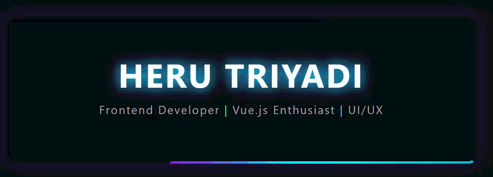

<!-- Banner Section -->

  

<!-- Contact Badges -->

 

---

### &#128104;&#8205;&#128187; ABOUT ME

 

<table align="center" border="0" style="border: none; border-collapse: collapse;">
  <tr style="border: none;">
    <td align="center" width="350" style="border: none;">
      <!-- Logo Digital Hacker -->
      
    </td>
    <td width="550" style="border: none;">
      <h3>Hi there! 👋 I'm Heru Triyadi</h3>
      
I am a passionate <strong>Frontend Developer</strong> with a strong focus on <b>Vue.js</b> and <b>UI/UX Design</b>. I love transforming ideas into beautifully coded, intuitive interfaces that provide great user experiences.

       
      🌱 <b>Currently exploring:</b> Advanced Vue Ecosystem & Modern UI  
      🤝 <b>Open for:</b> Collaboration on awesome web projects  
      💬 <b>Ask me about:</b> Frontend, Vue.js, and Web Animations  
      📫 <b>Reach me at:</b> <a href="mailto:herutriyadih2@gmail.com">herutriyadih2@gmail.com</a>
    </td>
  </tr>
</table>

 

---

### &#128736; TECH STACK & TOOLS

   
  
<b>Languages & Frameworks</b>

  
    
  
<b>UI/UX & Development Tools</b>

  
   

 

---

### &#128202; GITHUB STATS

   
  
  <!-- Menggunakan GitHub Streak Stats (Server Berbeda dan Stabil) -->
  
  
    
  
  <!-- Menambahkan Grafik Aktivitas Repositori -->
  
  
   

 

---

### &#9889; "BUILDING EXPERIENCES, ONE PIXEL AT A TIME."

  
&#169; 2026 <b>Heru Triyadi</b>

