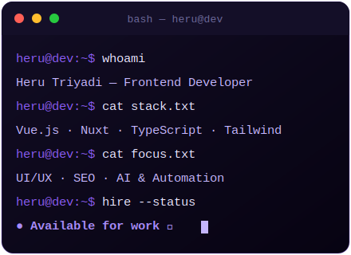

<!-- ======================= BANNER GLOBE DIGITAL (animasi) ======================= -->

<!-- ======================= TYPING EFFECT ======================= -->

<!-- ======================= BADGES ATAS ======================= -->

  
  

<!-- ======================= TENTANG SAYA ======================= -->
## 🧑‍💻 Tentang Saya

> **Ideas Into Reality** — membangun web yang cepat, rapi, dan berdampak.

- 💻 **Frontend Developer** — spesialis **Vue.js**
- 🎨 **UI/UX Designer** — desain modern, minimalis, & fungsional
- 🔍 **SEO Specialist** — optimasi peringkat, traffic, & pertumbuhan
- 🤖 **AI & Automation** — solusi cerdas untuk pekerjaan repetitif
- 🚁 Suka eksplor **drone FPV & Smart Drone AI**
- 🌱 Sedang mendalami: **Vue.js, Node.js & Tailwind CSS**
- 📍 Berbasis di **Kalimantan Barat, Indonesia** 🇮🇩

 

<!-- ======================= KEAHLIAN / LAYANAN ======================= -->
## 🚀 Keahlian & Layanan

| 🌐 Web Development | 🎨 UI/UX Design | 🔍 SEO Optimization | 🤖 AI & Automation |
|:---:|:---:|:---:|:---:|
| HTML · CSS · JS · Vue | Modern & Minimal | Rank · Traffic · Growth | Smart Solution |

<!-- ======================= TECH STACK ======================= -->
## 🛠️ Tech Stack & Tools

### Bahasa & Web

### Framework & Library

### Design & Tools

 

<!-- Ikon animasi bergaya (skillicons) -->

<!-- ======================= GITHUB STATS ======================= -->
## 📊 Statistik GitHub

 

<!-- ======================= TROPHY ======================= -->
<!-- ======================= FEATURED PROJECTS ======================= -->
## 📌 Proyek Pilihan

| Proyek | Deskripsi | Tech |
|:--|:--|:--:|
| 🌐 **[Portfolio Website](https://herutriyadi.my.id)** | Portofolio pribadi interaktif — live di **herutriyadi.my.id** |  |
| 🚁 **[Rancangan Drone FPV](https://github.com/herutriyadih2-cloud/rancangan-drone-fpv)** | Desain 3D drone FPV freestyle 5" — model interaktif, firmware, simulator PID, anggaran |  |
| 🤖 **[Smart Drone AI](https://github.com/herutriyadih2-cloud/smart-drone-ai)** | Proposal desain drone berbasis AI (skala internasional) |  |

<!-- ======================= SNAKE ANIMATION ======================= -->
## 🐍 Kontribusi

Animasi ular muncul otomatis setelah GitHub Action pertama berjalan.

<!-- ======================= KONTAK / SOSIAL ======================= -->
## 📫 Hubungi Saya

<!-- ======================= FOOTER ======================= -->

